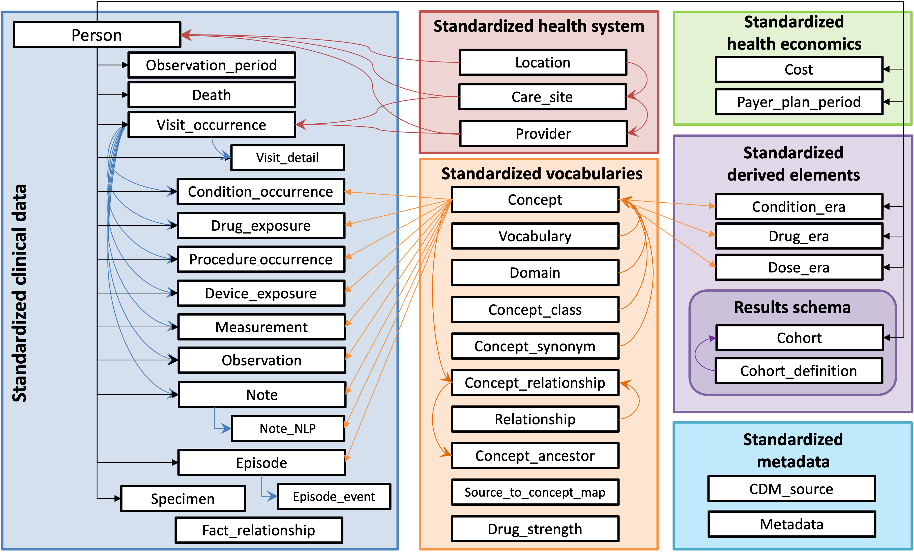
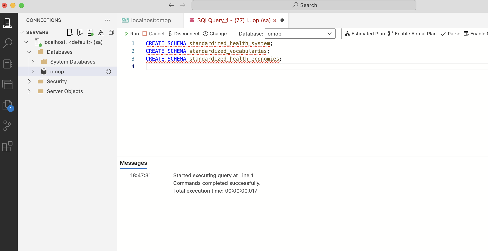
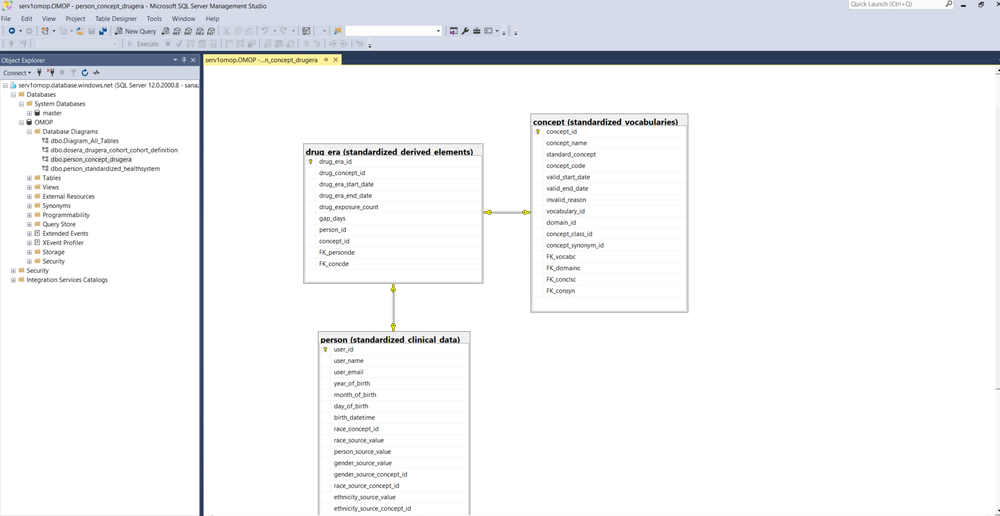

OMOP is the Observational Medical Outcomes Partnership common data model proposed by Observational Health Data Sciences and Informatics (<a href="https://www.ohdsi.org/data-standardization/" target="_blank">OHDSI</a>) organization.  
The following architecture is taken from their website: 

Employing OMOP common data model architecture ensures NORMALIZATION while designing the relational database. 
Thanks to great documentation provided by <a href="https://www.ohdsi.org/data-standardization/" target="_blank">OHDSI</a>.
The fields of tables in OMOP (Create_OMOP.sql file) are according to standard github repo from OHDSI official GitHub.
  

  Make sure you are connected to the right database in your running server.  
  - create schemas
  

  - Create tables - ensure clear and consistent naming for tables and columns. 
    The tables should be created with the following priorities:

|    | Schema   | TableName |
| --- | --- | --- |
|1.  |  standardized_health_system     | location |
|2.  |  standardized_health_system     | care_site  |
|3.  |  standardized_health_system     | provider |
|4.  |  standardized_clinical_data     | person |
|5.  |  standardized_health_economies  | payer_plan_period |
|6.  |   standardized_metadata         |CDM_source |
|7.  |  standardized_metadata          |  metadata |
|8.  |  results_schema                 | cohort_definition |
|9.  |  results_schema                 |  cohort |
|10. |  standardized_clinical_data     |  observation_period |
|11. |  standardized_clinical_data     |  death |
|12. |  standardized_clinical_data     |  visit_occurrence | 
|13. |  standardized_clinical_data     |  visit_detail | 
|14. |  standardized_clinical_data     |  specimen | 
|15. |  standardized_clinical_data     |  fact_relationship | 
|17. |  standardized_vocabularies      |  source_to_concept_map | 
|18. |  standardized_vocabularies      |  drug_strength | 
|19. |  standardized_vocabularies      |  vocabulary | 
|20. |  standardized_vocabularies      |  domain | 
|21. |  standardized_vocabularies      |  concept_class | 
|22. |  standardized_vocabularies      |  concept_synonym | 
|23. |  standardized_vocabularies      |  concept | 
|24. |  standardized_vocabularies      |  relationship | 
|25. |  standardized_vocabularies      |  concept_relationship | 
|26. | standardized_vocabularies      |  concept_ancestor | 
|27. | standardized_derived_elements  |  condition_era | 
|28. | standardized_derived_elements  |  drug_era | 
|29. | standardized_derived_elements  |  dose_era | 
|30. | standardized_clinical_data     |  condition_occurrence | 
|31. | standardized_clinical_data     |  drug_exposure | 
|32. | standardized_clinical_data     |  procedure_occurrence | 
|33. | standardized_clinical_data     |  device_exposure | 
|34. | standardized_clinical_data      | measurements | 
|35. | standardized_clinical_data      | observation | 
|36. | standardized_clinical_data      | note | 
|37. | standardized_clinical_data      | note_NLP | 
|38. | standardized_clinical_data      | episode |
|39. | standardized_clinical_data      | episode_event | 

  - SQL Server Management Studio (SSMS) from Microsoft is available for Windows and has the capability of showing database Entity Relationship Diagram. 

  Here is a generated diagram for the following tables of our OMOP: "drug_era", "concept", and "person" 

