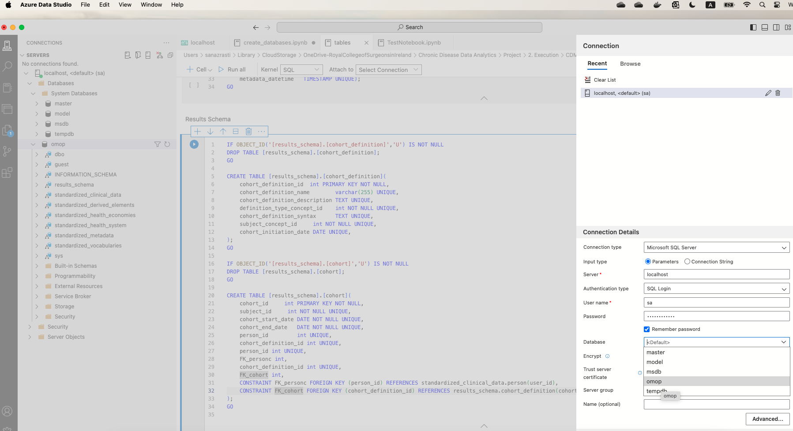

## Servers 
### 1. Localhost SQL Server, using the MS-SQL-Docker-Image  

Run a local SQL server using Docker, given the fact that 
- Have Docker installed
- Pull MS SQL Server Docker Image: cmd --> docker pull mcr.microsoft.com/mssql/server 
- Run the Image container, using port 1433:1433 : 
    docker run -e 'ACCEPT_EULA=Y' -e 'SA_PASSWORD=***' -p 1433:1433 --name sql_server -d mcr.microsoft.com/mssql/server
- Enter the container: docker exec -it sql_server /bin/bash
- Connect to container: /opt/mssql-tools/bin/sqlcmd -S localhost -U SA -P '***'
- Once you have the docker image of sql server up and running, connect to it via Azure SSMS. 
- Open SSMS
- Connect to server:  &emsp; &emsp; server: localhost 
                         &emsp; &emsp; auth  : SQL login 
                         &emsp; &emsp; uname : sa
                         &emsp; &emsp; pass  : '***'

 

 

### 2. SQL server hosted within MicroSoft, reading through <a href="https://docs.readme.com/main/docs/linking-to-pages#:~:text=To%20link%20inline%2C%20type%20the,within%20parentheses%2C%20(y)%20." target="_blank">Azure SQL Documentation</a> would be useful too.  
Aiming at using the Azure SQL Database service, a more successful setting would be:
     &emsp; - Create a Microsoft account (if possible log in with your organization account) 
     &emsp; - Create a Resource Group that would encapsulate all the resources for building your solution - first things first 
     &emsp; - Every time you want to create a storage account or SQL-VM you may use the corresponding resource group. 
     &emsp; - Create a SQL-Server (appointing the resource group)
     &emsp; - Create a Database within that SQL-Server
     &emsp; - Open the Database, at the bottom of page navigate to "Start Developing" --> "Open Azure Data Studio"
     &emsp; - This should automatically open your Azure Data studio and connection window pointing at corresponding server.  
    

### 3. Start data analytics within Azure Synapse Analytics
In order to manage the database in synapse environment:
      &emsp; - Create Synapse workspace > using the resource group that your database lies in. 
      &emsp; - Built-in SQL pool is automatically created, with type: Serverless SQL database
      &emsp; - Create Apache Spark Pool 
      &emsp; - Open the Synapse workspace  
      &emsp; - Overview tab: click on Workspace web URL  
      &emsp; - in Synapse workspace create new SQL database (+) , called OMOP in my current works-space
      &emsp; - Overview tab: use Serverless SQL endpoint 
      &emsp; - Create External tables in Serverless SQL 
      &emsp; - 

#### Synapse Security Setup:
Access to MS Azure Synapse workspace can be controlled by: 
  &emsp; 1. Azure roles (Azure role-based access control)<a href="https://learn.microsoft.com/en-us/azure/role-based-access-control/overview"> Azure RBAC</a>. Good for resource management and access to data storage. Within each RBAC three principals need to be considered:
  &emsp; &emsp; a.  Security Principal 
  &emsp; &emsp; b.  Role Definition
  &emsp; &emsp; c.  Scope
  &emsp; 2. Azure Synapse roles: good for managing live access to code and execution. 
  &emsp; 3. SQL permissions: Manage Serverless SQL pool. Looking after the security of data plane access. Data plane refers to infrastructure that handles the actual data operations, such as querying, transforming, and storing data. 
  &emsp; 4. Git permissions

